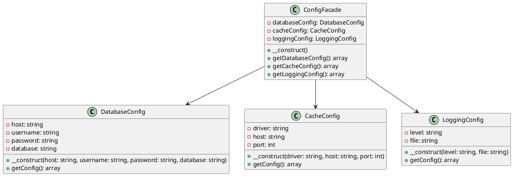

# PHP

Представьте, что мы — команда разработчиков, работающая над веб-приложением. Наше приложение имеет множество настроек и конфигураций, таких как подключение к базе данных, настройки кэширования, параметры логирования и многое другое. Все эти настройки хранятся в разных местах и управляются разными классами. Наша задача — упростить управление этими конфигурациями, чтобы другие разработчики могли легко и быстро изменять настройки без необходимости понимать внутреннюю структуру приложения.

Для этого мы решили использовать паттерн проектирования "Фасад" (Facade). Фасад предоставляет простой интерфейс для сложной системы классов, библиотек или фреймворков. В нашем случае, фасад будет предоставлять единый интерфейс для управления всеми конфигурациями приложения.

#### Пример кода на PHP

**1. Классы для управления конфигурациями**


```php
// Класс для управления настройками базы данных
class DatabaseConfig {
    private $host;
    private $username;
    private $password;
    private $database;

    public function __construct($host, $username, $password, $database) {
        $this->host = $host;
        $this->username = $username;
        $this->password = $password;
        $this->database = $database;
    }

    public function getConfig() {
        return [
            'host' => $this->host,
            'username' => $this->username,
            'password' => $this->password,
            'database' => $this->database
        ];
    }
}

// Класс для управления настройками кэширования
class CacheConfig {
    private $driver;
    private $host;
    private $port;

    public function __construct($driver, $host, $port) {
        $this->driver = $driver;
        $this->host = $host;
        $this->port = $port;
    }

    public function getConfig() {
        return [
            'driver' => $this->driver,
            'host' => $this->host,
            'port' => $this->port
        ];
    }
}

// Класс для управления настройками логирования
class LoggingConfig {
    private $level;
    private $file;

    public function __construct($level, $file) {
        $this->level = $level;
        $this->file = $file;
    }

    public function getConfig() {
        return [
            'level' => $this->level,
            'file' => $this->file
        ];
    }
}
```


**2. Класс Фасада**


```php
// Класс Фасада для управления всеми конфигурациями
class ConfigFacade {
    private $databaseConfig;
    private $cacheConfig;
    private $loggingConfig;

    public function __construct() {
        // Инициализация конфигураций с дефолтными значениями
        $this->databaseConfig = new DatabaseConfig('localhost', 'root', 'password', 'mydb');
        $this->cacheConfig = new CacheConfig('redis', 'localhost', 6379);
        $this->loggingConfig = new LoggingConfig('info', '/var/log/app.log');
    }

    // Метод для получения конфигурации базы данных
    public function getDatabaseConfig() {
        return $this->databaseConfig->getConfig();
    }

    // Метод для получения конфигурации кэширования
    public function getCacheConfig() {
        return $this->cacheConfig->getConfig();
    }

    // Метод для получения конфигурации логирования
    public function getLoggingConfig() {
        return $this->loggingConfig->getConfig();
    }
}
```


**3. Использование Фасада**


```php
// Пример использования Фасада
$configFacade = new ConfigFacade();

// Получение конфигурации базы данных
$dbConfig = $configFacade->getDatabaseConfig();
print_r($dbConfig);

// Получение конфигурации кэширования
$cacheConfig = $configFacade->getCacheConfig();
print_r($cacheConfig);

// Получение конфигурации логирования
$loggingConfig = $configFacade->getLoggingConfig();
print_r($loggingConfig);
```


#### UML диаграмма

<figure><figcaption><p>UML диаграмма для паттерна "Фасад"</p></figcaption></figure>





#### Вывод для кейса

Использование паттерна "Фасад" позволило нам создать простой и удобный интерфейс для управления конфигурациями нашего приложения. Теперь другие разработчики могут легко получать и изменять настройки, не вдаваясь в детали реализации каждого из классов. Это упрощает работу с конфигурацией и делает код более читаемым и поддерживаемым.
