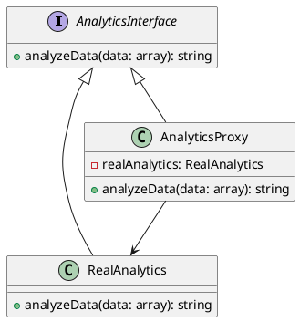

# PHP

Представьте, что вы работаете в компании, которая занимается разработкой системы аналитики. Ваш сеньор-разработчик поставил задачу: оптимизировать код системы аналитики для повышения производительности. Одной из проблем, которую нужно решить, является ленивая инициализация объектов. Это означает, что объекты должны создаваться только тогда, когда они действительно нужны, а не сразу при запуске программы. Это поможет сэкономить ресурсы и улучшить производительность системы.

#### Кейс применения паттерна Заместитель

Паттерн Заместитель (Proxy) позволяет создать объект-заместитель, который управляет доступом к другому объекту. В нашем случае, мы будем использовать этот паттерн для ленивой инициализации объектов.

#### Пример кода на PHP

**1. Создание интерфейса для аналитики**


```php
<?php
interface AnalyticsInterface {
    public function analyzeData(array $data): string;
}
```


**2. Реализация класса аналитики**


```php
class RealAnalytics implements AnalyticsInterface {
    public function analyzeData(array $data): string {
        // Симуляция сложного анализа данных
        sleep(2); // Имитация долгой операции
        return "Анализ данных завершен: " . implode(", ", $data);
    }
}
```


**3. Создание класса-заместителя**


```php
class AnalyticsProxy implements AnalyticsInterface {
    private $realAnalytics = null;

    public function analyzeData(array $data): string {
        // Ленивая инициализация реального объекта аналитики
        if ($this->realAnalytics === null) {
            $this->realAnalytics = new RealAnalytics();
        }
        // Делегирование выполнения реальному объекту
        return $this->realAnalytics->analyzeData($data);
    }
}
```


**4. Использование класса-заместителя**


```php
$analytics = new AnalyticsProxy();

// Первый вызов, объект RealAnalytics будет создан
echo $analytics->analyzeData(["данные1", "данные2"]);

// Второй вызов, объект RealAnalytics уже создан и используется снова
echo $analytics->analyzeData(["данные3", "данные4"]);
```


#### Объяснение кода

1. **Интерфейс AnalyticsInterface**: Определяет метод `analyzeData`, который должен быть реализован всеми классами, работающими с аналитикой.
2. **Класс RealAnalytics**: Реализует интерфейс `AnalyticsInterface` и содержит реальную логику анализа данных. В данном примере используется `sleep(2)` для имитации долгой операции.
3. **Класс AnalyticsProxy**: Реализует интерфейс `AnalyticsInterface` и содержит логику ленивой инициализации. Объект `RealAnalytics` создается только при первом вызове метода `analyzeData`. Это позволяет отложить создание объекта до тех пор, пока он действительно не понадобится.
4. **Использование класса-заместителя**: Создаем объект `AnalyticsProxy` и вызываем метод `analyzeData`. При первом вызове объект `RealAnalytics` создается, а при последующих вызовах используется уже созданный объект.

#### UML диаграмма

<figure><figcaption><p>UML диаграмма для паттерна "Заместитель"</p></figcaption></figure>





#### Вывод для кейса

Использование паттерна Заместитель (Proxy) позволяет нам оптимизировать систему аналитики за счет ленивой инициализации объектов. Это помогает сэкономить ресурсы и улучшить производительность системы, так как объекты создаются только тогда, когда они действительно нужны. В результате, система становится более эффективной и отзывчивой.
