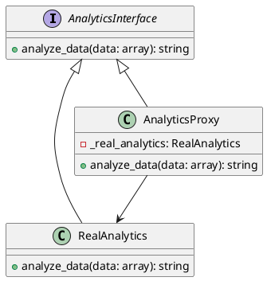

# Python

Представьте, что вы работаете в компании, которая занимается разработкой системы аналитики. Ваш сеньор-разработчик поставил задачу: оптимизировать код системы аналитики для повышения производительности. Одной из проблем, которую нужно решить, является ленивая инициализация объектов. Это означает, что объекты должны создаваться только тогда, когда они действительно нужны, а не сразу при запуске программы. Это поможет сэкономить ресурсы и улучшить производительность системы.

#### Кейс применения паттерна Заместитель

Паттерн Заместитель (Proxy) позволяет создать объект-заместитель, который управляет доступом к другому объекту. В нашем случае, мы будем использовать этот паттерн для ленивой инициализации объектов.

#### Пример кода на Python

**1. Создание интерфейса для аналитики**


```python
from abc import ABC, abstractmethod
import time

class AnalyticsInterface(ABC):
    @abstractmethod
    def analyze_data(self, data):
        pass
```


**2. Реализация класса аналитики**


```python
class RealAnalytics(AnalyticsInterface):
    def analyze_data(self, data):
        # Симуляция сложного анализа данных
        time.sleep(2)  # Имитация долгой операции
        return f"Анализ данных завершен: {', '.join(data)}"
```


**3. Создание класса-заместителя**


```python
class AnalyticsProxy(AnalyticsInterface):
    def __init__(self):
        self._real_analytics = None

    def analyze_data(self, data):
        # Ленивая инициализация реального объекта аналитики
        if self._real_analytics is None:
            self._real_analytics = RealAnalytics()
        # Делегирование выполнения реальному объекту
        return self._real_analytics.analyze_data(data)
```


**4. Использование класса-заместителя**


```python
if __name__ == "__main__":
    analytics = AnalyticsProxy()

    # Первый вызов, объект RealAnalytics будет создан
    print(analytics.analyze_data(["данные1", "данные2"]))

    # Второй вызов, объект RealAnalytics уже создан и используется снова
    print(analytics.analyze_data(["данные3", "данные4"]))
```


#### Объяснение кода

1. **Интерфейс AnalyticsInterface**: Определяет метод `analyze_data`, который должен быть реализован всеми классами, работающими с аналитикой.
2. **Класс RealAnalytics**: Реализует интерфейс `AnalyticsInterface` и содержит реальную логику анализа данных. В данном примере используется `time.sleep(2)` для имитации долгой операции.
3. **Класс AnalyticsProxy**: Реализует интерфейс `AnalyticsInterface` и содержит логику ленивой инициализации. Объект `RealAnalytics` создается только при первом вызове метода `analyze_data`. Это позволяет отложить создание объекта до тех пор, пока он действительно не понадобится.
4. **Использование класса-заместителя**: Создаем объект `AnalyticsProxy` и вызываем метод `analyze_data`. При первом вызове объект `RealAnalytics` создается, а при последующих вызовах используется уже созданный объект.

#### UML диаграмма&#x20;

<figure><figcaption><p>UML диаграмма для паттерна "Заместитель"</p></figcaption></figure>





#### Вывод для кейса

Использование паттерна Заместитель (Proxy) позволяет нам оптимизировать систему аналитики за счет ленивой инициализации объектов. Это помогает сэкономить ресурсы и улучшить производительность системы, так как объекты создаются только тогда, когда они действительно нужны. В результате, система становится более эффективной и отзывчивой.
