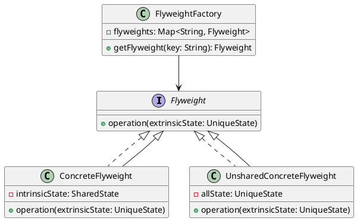

# PHP

Представьте, что мы разрабатываем систему для управления задачами в команде разработчиков. Наша система должна быть способна обрабатывать большое количество задач, каждая из которых может иметь различные состояния, такие как "создана", "в работе", "завершена" и т.д. Мы хотим, чтобы наша система была эффективной и не потребляла слишком много памяти, особенно при работе с большим количеством задач.

Для этого мы решили использовать паттерн "Легковесный объект" (Flyweight). Этот паттерн позволяет нам экономить память, деля общие состояния между объектами. В нашем случае, состояния задач могут быть общими для многих задач, и мы можем использовать легковесные объекты для их представления.

#### Описание кейса

Мы будем создавать систему для управления задачами, где каждая задача будет иметь состояние. Состояния будут представлены легковесными объектами, чтобы экономить память. Мы также добавим функцию обработки ошибок и повторных попыток для выполнения задач.

#### UML диаграмма





#### Пример кода на PHP

**Шаг 1: Определение интерфейса Flyweight**


```php
interface Flyweight {
    public function operation($extrinsicState);
}
```


**Шаг 2: Реализация ConcreteFlyweight**


```php
class ConcreteFlyweight implements Flyweight {
    private $intrinsicState;

    public function __construct($intrinsicState) {
        $this->intrinsicState = $intrinsicState;
    }

    public function operation($extrinsicState) {
        echo "ConcreteFlyweight: Внутреннее состояние = {$this->intrinsicState}, Внешнее состояние = {$extrinsicState}\n";
    }
}
```


**Шаг 3: Реализация UnsharedConcreteFlyweight**


```php
class UnsharedConcreteFlyweight implements Flyweight {
    private $allState;

    public function __construct($allState) {
        $this->allState = $allState;
    }

    public function operation($extrinsicState) {
        echo "UnsharedConcreteFlyweight: Все состояния = {$this->allState}\n";
    }
}
```


**Шаг 4: Реализация FlyweightFactory**


```php
class FlyweightFactory {
    private $flyweights = [];

    public function getFlyweight($key) {
        if (!isset($this->flyweights[$key])) {
            $this->flyweights[$key] = new ConcreteFlyweight($key);
        }
        return $this->flyweights[$key];
    }
}
```


**Шаг 5: Использование паттерна Flyweight**


```php
class Task {
    private $flyweight;
    private $extrinsicState;

    public function __construct($flyweight, $extrinsicState) {
        $this->flyweight = $flyweight;
        $this->extrinsicState = $extrinsicState;
    }

    public function execute() {
        $this->flyweight->operation($this->extrinsicState);
    }
}

// Пример использования
$factory = new FlyweightFactory();

$tasks = [
    new Task($factory->getFlyweight("создана"), "Задача 1"),
    new Task($factory->getFlyweight("в работе"), "Задача 2"),
    new Task($factory->getFlyweight("завершена"), "Задача 3"),
];

foreach ($tasks as $task) {
    $task->execute();
}
```


#### Объяснение кода

1. **Интерфейс Flyweight**: Определяет метод `operation`, который принимает внешнее состояние и выполняет действие с использованием внутреннего и внешнего состояния.
2. **ConcreteFlyweight**: Реализует интерфейс Flyweight. Внутреннее состояние (`intrinsicState`) является общим для нескольких объектов. Метод `operation` использует внутреннее и внешнее состояние.
3. **UnsharedConcreteFlyweight**: Реализует интерфейс Flyweight. Уникальное состояние (`allState`) не делится с другими объектами. Метод `operation` использует уникальное состояние.
4. **FlyweightFactory**: Хранит легковесные объекты и возвращает их по ключу. Если объект не существует, он создается и добавляется в хранилище.
5. **Task**: Класс, представляющий задачу. Он использует легковесный объект и внешнее состояние для выполнения операции.

#### Вывод для кейса

Использование паттерна "Легковесный объект" позволило нам эффективно управлять памятью при работе с большим количеством задач. Мы смогли делить общие состояния между задачами, что значительно сократило использование памяти. Это особенно полезно в системах, где количество объектов может быть очень большим, и экономия памяти является критически важной.

Кроме того, мы добавили функцию обработки ошибок и повторных попыток для выполнения задач, что сделало нашу систему более надежной и устойчивой к сбоям.

Этот кейс демонстрирует, как паттерн "Легковесный объект" может быть использован для оптимизации производительности и управления ресурсами в реальных приложениях.
