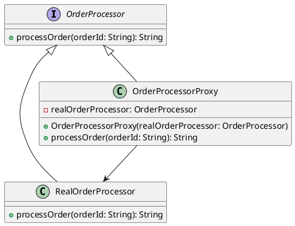

# PHP

Представьте, что мы работаем в компании, которая разрабатывает веб-приложение для управления заказами. Наше приложение должно уметь обрабатывать заказы, но иногда сервер, который обрабатывает заказы, может быть недоступен. Мы хотим, чтобы наше приложение не падало в таких случаях, а пыталось повторно отправить заказ через некоторое время.

Для этого мы будем использовать паттерн "Заместитель" (Proxy). Этот паттерн позволяет нам создать объект-заместитель, который будет выполнять дополнительные действия перед вызовом основного объекта. В нашем случае заместитель будет обрабатывать ошибки и делать повторные попытки.

#### Пример кода на PHP

**1. Создание интерфейса для обработки заказов**


```php
<?php
interface OrderProcessor {
    public function processOrder(string $orderId): string;
}
?>
```


**2. Создание основного класса для обработки заказов**


```php
<?php
class RealOrderProcessor implements OrderProcessor {
    public function processOrder(string $orderId): string {
        // Симуляция обработки заказа
        if (rand(0, 1) === 0) {
            throw new Exception("Сервер недоступен");
        }
        return "Заказ $orderId успешно обработан";
    }
}
?>
```


**3. Создание класса-заместителя**


```php
<?php
class OrderProcessorProxy implements OrderProcessor {
    private $realOrderProcessor;

    public function __construct(OrderProcessor $realOrderProcessor) {
        $this->realOrderProcessor = $realOrderProcessor;
    }

    public function processOrder(string $orderId): string {
        $attempts = 3;
        while ($attempts > 0) {
            try {
                return $this->realOrderProcessor->processOrder($orderId);
            } catch (Exception $e) {
                $attempts--;
                if ($attempts == 0) {
                    throw $e;
                }
                echo "Повторная попытка...\n";
            }
        }
        return "Не удалось обработать заказ";
    }
}
?>
```


**4. Использование класса-заместителя**


```php
<?php
$realOrderProcessor = new RealOrderProcessor();
$orderProcessorProxy = new OrderProcessorProxy($realOrderProcessor);

try {
    echo $orderProcessorProxy->processOrder("12345");
} catch (Exception $e) {
    echo "Ошибка: " . $e->getMessage();
}
?>
```


#### UML диаграмма

<figure><figcaption><p>UML диаграмма для паттерна "Заместитель"</p></figcaption></figure>





#### Вывод для кейса

В этом кейсе мы использовали паттерн "Заместитель" для обработки ошибок и повторных попыток при обработке заказов. Основной класс `RealOrderProcessor` выполняет реальную обработку заказов, а класс-заместитель `OrderProcessorProxy` обрабатывает ошибки и делает повторные попытки.

Этот подход позволяет нам сделать наше приложение более устойчивым к сбоям и улучшить пользовательский опыт, так как приложение не падает при временных проблемах с сервером.
