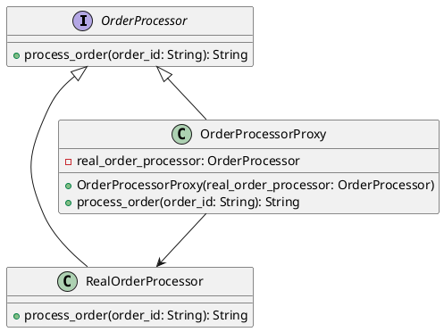

# Python

Представьте, что мы работаем в компании, которая разрабатывает веб-приложение для управления заказами. Наше приложение должно уметь обрабатывать заказы, но иногда сервер, который обрабатывает заказы, может быть недоступен. Мы хотим, чтобы наше приложение не падало в таких случаях, а пыталось повторно отправить заказ через некоторое время.

Для этого мы будем использовать паттерн "Заместитель" (Proxy). Этот паттерн позволяет нам создать объект-заместитель, который будет выполнять дополнительные действия перед вызовом основного объекта. В нашем случае заместитель будет обрабатывать ошибки и делать повторные попытки.

#### Пример кода на Python

**1. Создание интерфейса для обработки заказов**


```python
from abc import ABC, abstractmethod

class OrderProcessor(ABC):
    @abstractmethod
    def process_order(self, order_id: str) -> str:
        pass
```


**2. Создание основного класса для обработки заказов**


```python
import random

class RealOrderProcessor(OrderProcessor):
    def process_order(self, order_id: str) -> str:
        # Симуляция обработки заказа
        if random.randint(0, 1) == 0:
            raise Exception("Сервер недоступен")
        return f"Заказ {order_id} успешно обработан"
```


**3. Создание класса-заместителя**


```python
import time

class OrderProcessorProxy(OrderProcessor):
    def __init__(self, real_order_processor: OrderProcessor):
        self.real_order_processor = real_order_processor

    def process_order(self, order_id: str) -> str:
        attempts = 3
        while attempts > 0:
            try:
                return self.real_order_processor.process_order(order_id)
            except Exception as e:
                attempts -= 1
                if attempts == 0:
                    raise e
                print("Повторная попытка...")
                time.sleep(1)  # Пауза перед повторной попыткой
        return "Не удалось обработать заказ"
```


**4. Использование класса-заместителя**


```python
def main():
    real_order_processor = RealOrderProcessor()
    order_processor_proxy = OrderProcessorProxy(real_order_processor)

    try:
        result = order_processor_proxy.process_order("12345")
        print(result)
    except Exception as e:
        print(f"Ошибка: {e}")

if __name__ == "__main__":
    main()
```


#### UML диаграмма

<figure><figcaption><p>UML диаграмма для паттерна "Заместитель"</p></figcaption></figure>



#### Вывод для кейса

В этом кейсе мы использовали паттерн "Заместитель" для обработки ошибок и повторных попыток при обработке заказов. Основной класс `RealOrderProcessor` выполняет реальную обработку заказов, а класс-заместитель `OrderProcessorProxy` обрабатывает ошибки и делает повторные попытки.

Этот подход позволяет нам сделать наше приложение более устойчивым к сбоям и улучшить пользовательский опыт, так как приложение не падает при временных проблемах с сервером.
