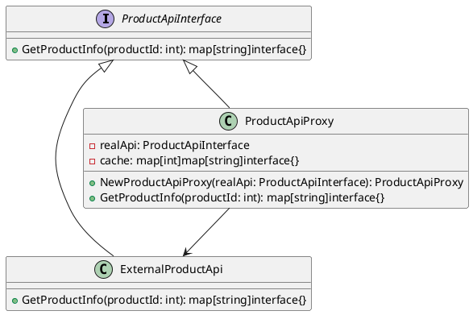

# Go

Представьте, что вы работаете в команде разработчиков интернет-магазина. Ваш тимлид поставил задачу улучшить стабильность приложения, особенно в части взаимодействия с внешним API, который предоставляет информацию о товарах. Внешний API иногда бывает медленным или недоступным, что приводит к задержкам и ошибкам в вашем приложении.

Для решения этой проблемы мы решили использовать паттерн "Заместитель" (Proxy). Этот паттерн позволяет нам создать промежуточный объект, который будет управлять доступом к внешнему API и кэшировать результаты запросов, чтобы уменьшить количество обращений к внешнему сервису и улучшить производительность нашего приложения.

#### Описание паттерна "Заместитель"

Паттерн "Заместитель" (Proxy) используется для создания объекта, который контролирует доступ к другому объекту. В нашем случае, мы создадим прокси-объект, который будет управлять доступом к внешнему API и кэшировать результаты запросов.

#### Пример кода на Go

**1. Создание интерфейса для взаимодействия с API**


```go
package main

import (
	"fmt"
	"time"
)

type ProductApiInterface interface {
	GetProductInfo(productId int) map[string]interface{}
}
```


**2. Реализация класса для взаимодействия с внешним API**


```go
type ExternalProductApi struct{}

func (e *ExternalProductApi) GetProductInfo(productId int) map[string]interface{} {
	// Симуляция запроса к внешнему API
	time.Sleep(2 * time.Second) // Задержка для имитации медленного ответа
	return map[string]interface{}{
		"id":           productId,
		"name":         fmt.Sprintf("Product %d", productId),
		"price":        100,
		"availability": "In stock",
	}
}
```


**3. Создание прокси-класса для кэширования результатов**


```go
type ProductApiProxy struct {
	realApi ProductApiInterface
	cache   map[int]map[string]interface{}
}

func NewProductApiProxy(realApi ProductApiInterface) *ProductApiProxy {
	return &ProductApiProxy{
		realApi: realApi,
		cache:   make(map[int]map[string]interface{}),
	}
}

func (p *ProductApiProxy) GetProductInfo(productId int) map[string]interface{} {
	// Проверка кэша
	if productInfo, ok := p.cache[productId]; ok {
		fmt.Println("Используем кэш для продукта", productId)
		return productInfo
	}

	// Если данных нет в кэше, делаем запрос к реальному API
	productInfo := p.realApi.GetProductInfo(productId)

	// Сохраняем результат в кэш
	p.cache[productId] = productInfo

	return productInfo
}
```


**4. Использование прокси-класса в приложении**


```go
func main() {
	// Создаем экземпляр реального API
	realApi := &ExternalProductApi{}

	// Создаем экземпляр прокси-класса
	proxyApi := NewProductApiProxy(realApi)

	// Получаем информацию о продукте через прокси
	productInfo1 := proxyApi.GetProductInfo(1)
	fmt.Println(productInfo1)

	// Повторный запрос той же информации о продукте
	productInfo2 := proxyApi.GetProductInfo(1)
	fmt.Println(productInfo2)
}
```


#### UML диаграмма

<figure><figcaption><p>UML диаграмма для паттерна "Заместитель"</p></figcaption></figure>





#### Объяснение кода

1. **Интерфейс `ProductApiInterface`**: Определяет метод `GetProductInfo`, который должен быть реализован в классах, работающих с API.
2. **Класс `ExternalProductApi`**: Реализует интерфейс `ProductApiInterface` и симулирует запрос к внешнему API с задержкой.
3. **Класс `ProductApiProxy`**: Реализует интерфейс `ProductApiInterface` и действует как прокси. Он кэширует результаты запросов и использует кэш при повторных запросах.
4. **Использование прокси-класса**: Создаем экземпляр реального API и прокси-класса, затем используем прокси для получения информации о продукте. При повторном запросе той же информации прокси использует кэш, что ускоряет ответ.

#### Вывод

Использование паттерна "Заместитель" (Proxy) позволяет нам оптимизировать запросы к внешнему API, кэшируя результаты и уменьшая количество обращений к внешнему сервису. Это улучшает производительность нашего приложения и делает его более устойчивым к проблемам с внешним API. В нашем примере мы создали прокси-класс, который кэширует результаты запросов и использует кэш при повторных запросах, что значительно ускоряет ответ на запросы.
