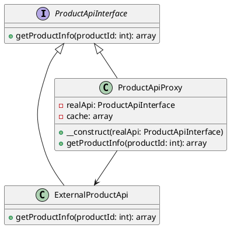

# PHP

Представьте, что вы работаете в команде разработчиков интернет-магазина. Ваш тимлид поставил задачу улучшить стабильность приложения, особенно в части взаимодействия с внешним API, который предоставляет информацию о товарах. Внешний API иногда бывает медленным или недоступным, что приводит к задержкам и ошибкам в вашем приложении.

Для решения этой проблемы мы решили использовать паттерн "Заместитель" (Proxy). Этот паттерн позволяет нам создать промежуточный объект, который будет управлять доступом к внешнему API и кэшировать результаты запросов, чтобы уменьшить количество обращений к внешнему сервису и улучшить производительность нашего приложения.

#### Описание паттерна "Заместитель"

Паттерн "Заместитель" (Proxy) используется для создания объекта, который контролирует доступ к другому объекту. В нашем случае, мы создадим прокси-объект, который будет управлять доступом к внешнему API и кэшировать результаты запросов.

#### Пример кода на PHP

**1. Создание интерфейса для взаимодействия с API**


```php
interface ProductApiInterface {
    public function getProductInfo($productId);
}
```


**2. Реализация класса для взаимодействия с внешним API**


```php
class ExternalProductApi implements ProductApiInterface {
    public function getProductInfo($productId) {
        // Симуляция запроса к внешнему API
        sleep(2); // Задержка для имитации медленного ответа
        return [
            'id' => $productId,
            'name' => 'Product ' . $productId,
            'price' => 100,
            'availability' => 'In stock'
        ];
    }
}
```


**3. Создание прокси-класса для кэширования результатов**


```php
class ProductApiProxy implements ProductApiInterface {
    private $realApi;
    private $cache = [];

    public function __construct(ProductApiInterface $realApi) {
        $this->realApi = $realApi;
    }

    public function getProductInfo($productId) {
        // Проверка кэша
        if (isset($this->cache[$productId])) {
            echo "Используем кэш для продукта $productId\n";
            return $this->cache[$productId];
        }

        // Если данных нет в кэше, делаем запрос к реальному API
        $productInfo = $this->realApi->getProductInfo($productId);

        // Сохраняем результат в кэш
        $this->cache[$productId] = $productInfo;

        return $productInfo;
    }
}
```


**4. Использование прокси-класса в приложении**


```php
// Создаем экземпляр реального API
$realApi = new ExternalProductApi();

// Создаем экземпляр прокси-класса
$proxyApi = new ProductApiProxy($realApi);

// Получаем информацию о продукте через прокси
$productInfo1 = $proxyApi->getProductInfo(1);
print_r($productInfo1);

// Повторный запрос той же информации о продукте
$productInfo2 = $proxyApi->getProductInfo(1);
print_r($productInfo2);
```


#### UML диаграмма

<figure><figcaption><p>UML диаграмма для паттерна "Заместитель"</p></figcaption></figure>





#### Объяснение кода

1. **Интерфейс `ProductApiInterface`**: Определяет метод `getProductInfo`, который должен быть реализован в классах, работающих с API.
2. **Класс `ExternalProductApi`**: Реализует интерфейс `ProductApiInterface` и симулирует запрос к внешнему API с задержкой.
3. **Класс `ProductApiProxy`**: Реализует интерфейс `ProductApiInterface` и действует как прокси. Он кэширует результаты запросов и использует кэш при повторных запросах.
4. **Использование прокси-класса**: Создаем экземпляр реального API и прокси-класса, затем используем прокси для получения информации о продукте. При повторном запросе той же информации прокси использует кэш, что ускоряет ответ.

#### Вывод

Использование паттерна "Заместитель" (Proxy) позволяет нам оптимизировать запросы к внешнему API, кэшируя результаты и уменьшая количество обращений к внешнему сервису. Это улучшает производительность нашего приложения и делает его более устойчивым к проблемам с внешним API. В нашем примере мы создали прокси-класс, который кэширует результаты запросов и использует кэш при повторных запросах, что значительно ускоряет ответ на запросы.
