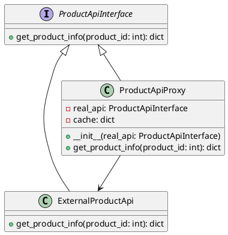

# Python

Представьте, что вы работаете в команде разработчиков интернет-магазина. Ваш тимлид поставил задачу улучшить стабильность приложения, особенно в части взаимодействия с внешним API, который предоставляет информацию о товарах. Внешний API иногда бывает медленным или недоступным, что приводит к задержкам и ошибкам в вашем приложении.

Для решения этой проблемы мы решили использовать паттерн "Заместитель" (Proxy). Этот паттерн позволяет нам создать промежуточный объект, который будет управлять доступом к внешнему API и кэшировать результаты запросов, чтобы уменьшить количество обращений к внешнему сервису и улучшить производительность нашего приложения.

#### Описание паттерна "Заместитель"

Паттерн "Заместитель" (Proxy) используется для создания объекта, который контролирует доступ к другому объекту. В нашем случае, мы создадим прокси-объект, который будет управлять доступом к внешнему API и кэшировать результаты запросов.

#### Пример кода на Python

**1. Создание интерфейса для взаимодействия с API**


```python
from abc import ABC, abstractmethod

class ProductApiInterface(ABC):
    @abstractmethod
    def get_product_info(self, product_id: int) -> dict:
        pass
```


**2. Реализация класса для взаимодействия с внешним API**


```python
import time

class ExternalProductApi(ProductApiInterface):
    def get_product_info(self, product_id: int) -> dict:
        # Симуляция запроса к внешнему API
        time.sleep(2)  # Задержка для имитации медленного ответа
        return {
            'id': product_id,
            'name': f'Product {product_id}',
            'price': 100,
            'availability': 'In stock'
        }
```


**3. Создание прокси-класса для кэширования результатов**


```python
class ProductApiProxy(ProductApiInterface):
    def __init__(self, real_api: ProductApiInterface):
        self.real_api = real_api
        self.cache = {}

    def get_product_info(self, product_id: int) -> dict:
        # Проверка кэша
        if product_id in self.cache:
            print(f"Используем кэш для продукта {product_id}")
            return self.cache[product_id]

        # Если данных нет в кэше, делаем запрос к реальному API
        product_info = self.real_api.get_product_info(product_id)

        # Сохраняем результат в кэш
        self.cache[product_id] = product_info

        return product_info
```


**4. Использование прокси-класса в приложении**


```python
if __name__ == "__main__":
    # Создаем экземпляр реального API
    real_api = ExternalProductApi()

    # Создаем экземпляр прокси-класса
    proxy_api = ProductApiProxy(real_api)

    # Получаем информацию о продукте через прокси
    product_info1 = proxy_api.get_product_info(1)
    print(product_info1)

    # Повторный запрос той же информации о продукте
    product_info2 = proxy_api.get_product_info(1)
    print(product_info2)
```


#### UML диаграмма

<figure><figcaption><p>UML диаграмма для паттерна "Заместитель"</p></figcaption></figure>





#### Объяснение кода

1. **Интерфейс `ProductApiInterface`**: Определяет метод `get_product_info`, который должен быть реализован в классах, работающих с API.
2. **Класс `ExternalProductApi`**: Реализует интерфейс `ProductApiInterface` и симулирует запрос к внешнему API с задержкой.
3. **Класс `ProductApiProxy`**: Реализует интерфейс `ProductApiInterface` и действует как прокси. Он кэширует результаты запросов и использует кэш при повторных запросах.
4. **Использование прокси-класса**: Создаем экземпляр реального API и прокси-класса, затем используем прокси для получения информации о продукте. При повторном запросе той же информации прокси использует кэш, что ускоряет ответ.

#### Вывод

Использование паттерна "Заместитель" (Proxy) позволяет нам оптимизировать запросы к внешнему API, кэшируя результаты и уменьшая количество обращений к внешнему сервису. Это улучшает производительность нашего приложения и делает его более устойчивым к проблемам с внешним API. В нашем примере мы создали прокси-класс, который кэширует результаты запросов и использует кэш при повторных запросах, что значительно ускоряет ответ на запросы.
